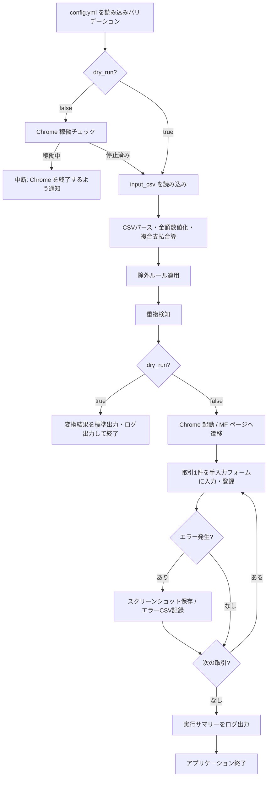

# 設計書

## 概要

### 背景・目的

- **背景**：PayPayの利用明細を目視で確認し、Money Forward ME に手動入力しているため工数が大きい。
- **目的**：PayPay CSV を `config.yml` に設定するだけで Money Forward ME への
  登録を自動化し、入力ミスと作業時間を削減する。

### 機能一覧

| No | 機能名 | 概要 |
| ---- | -------- | ------ |
| F01 | CSV取り込み | Shift_JIS / UTF-8 の文字コード自動判定、カンマ・ダブルクォート処理対応 |
| F02 | CSVパーシング | 全13カラムの抽出・金額数値化・複合支払合算・入出金判定・海外取引メモ追記 |
| F03 | 除外ルール | `exclude_prefixes` に合致する取引番号の行を処理対象外にする |
| F04 | 重複検知 | 取引番号優先（欠損時は日時＋金額＋取引先）でローカルまたは Google Cloud と比較 |
| F05 | MFへの自動登録 | Playwright で Chrome を制御し、MF の手入力フォームに1件ずつ登録する |
| F06 | マッピング設定 | キーワードベースのカテゴリマッピングを `config.yml` で定義・編集可能 |
| F07 | 実行前チェック | Chrome が稼働中なら処理を中断してユーザーに終了を促す |
| F08 | ドライランモード | ブラウザ不使用。CSV解析・変換結果の診断出力のみ行う |
| F09 | ログ出力 | 実行ログ・エラーCSV・スクリーンショットを `log_settings` に従い出力 |
| F10 | 設定ファイル | ツールフォルダ直下の `config.yml` で動作設定を一元管理する |
| F11 | エラーハンドリング | 操作失敗時はスクリーンショット・ログを保存しユーザーに再実行手順を提示 |

## 入力

### 設定ファイル

| 項目 | 内容 |
| ---- | ---- |
| ファイル名 | `config.yml` |
| 配置場所 | ツールフォルダ直下 |
| 形式 | YAML 1.2 |
| エンコーディング | UTF-8（BOM なし） |
| 内容概要 | ツールの全動作設定 |

スキーマの詳細は「設定ファイル YAMLスキーマ仕様書.md」を参照。

#### 必須項目（5項目。未記載で起動エラー）

| キー名 | データ型 | 説明 | 例 |
| ---- | ---- | ---- | ---- |
| chrome_user_data_dir | string | Chrome の User Data ディレクトリの絶対パス | `C:\Users\yourname\AppData\Local\Google\Chrome\User Data` |
| chrome_profile | string | 使用する Chrome プロファイルのフォルダ名 | `Default` |
| dry_run | boolean | `true`: CSV診断のみ（ブラウザ不使用）/ `false`: MF 本番登録 | `true` |
| input_csv | string | 処理対象の PayPay CSV ファイルパス | `C:\Users\yourname\Downloads\paypay_history.csv` |
| mf_account | string | MF の手入力フォームで選択する口座名 | `PayPay残高` |

```yaml
chrome_user_data_dir: "C:\\Users\\yourname\\AppData\\Local\\Google\\Chrome\\User Data"
chrome_profile: "Default"
dry_run: true
input_csv: "C:\\Users\\yourname\\Downloads\\paypay_history.csv"
mf_account: "PayPay残高"
```

### 入力CSVファイル（PayPay 利用明細）

| 項目 | 内容 |
| ---- | ---- |
| 取得元 | PayPay アプリの「取引履歴」画面からエクスポート |
| 形式 | CSV |
| エンコーディング | UTF-8 または Shift_JIS（BOM 付き可） |
| ヘッダー | あり（1行目） |
| 区切り文字 | `,` |

| 列名 | データ型 | 説明 |
| ---- | ---- | ---- |
| 取引日 | datetime | 例: `2025/02/11 22:32:13` |
| 出金金額（円） | string | 数値またはハイフン（`-`）。カンマ区切あり（例: `"1,280"`） |
| 入金金額（円） | string | 数値またはハイフン（`-`） |
| 海外出金金額 | string | 海外取引時の現地通貨金額。国内取引は `-` |
| 通貨 | string | 例: `JPY` / `USD`。国内取引は `-` |
| 変換レート（円） | string | 円換算レート。国内取引は `-` |
| 利用国 | string | 例: `JP`。国内取引は `-` |
| 取引内容 | string | MF メモ欄に転記される |
| 取引先 | string | マッピングルールのマッチング対象 |
| 取引方法 | string | 例: `PayPayカード VISA 4575` |
| 支払い区分 | string | 例: `一回払い` |
| 利用者 | string | 例: `本人` |
| 取引番号 | string | 重複検知の主キー。複合支払は同一番号で複数行 |

```csv
取引日,出金金額（円）,入金金額（円）,海外出金金額,通貨,変換レート（円）,利用国,取引内容,取引先,取引方法,支払い区分,利用者,取引番号
2025/02/11 19:24:02,920,-,-,-,-,-,支払い,モスのネット注文,クレジット VISA 4575,-,本人,04639628474580213761
2025/02/10 12:55:55,330,-,-,-,-,-,支払い,キャンドゥ　横浜橋商店街,"PayPayポイント (73円), クレジット VISA 4575 (257円)",-,本人,04638686270424956930
2025/02/08 23:59:04,-,120,-,-,-,-,ポイント、残高の獲得,giftee,PayPayポイント,-,-,856574761326657536-a0196d18
```

## 出力

### ログファイル

「ログ出力」の章に記載する。

### エラーCSVファイル

| 項目 | 内容 |
| ---- | ---- |
| ファイル名 | `error_yyyyMMdd_HHmmss.csv` |
| 配置場所 | `log_settings.logs_dir`（デフォルト: `<tool_folder>\logs`） |
| 内容概要 | 処理中に失敗した行の一覧 |

### スクリーンショット

| 項目 | 内容 |
| ---- | ---- |
| ファイル名 | `screenshot_yyyyMMdd_HHmmss.png` |
| 配置場所 | `log_settings.logs_dir` |
| 出力条件 | `advanced.screenshot_on_error: true` かつエラー発生時 |

## 実行方法

### 前提条件

1. `config.yml` をツールフォルダ直下に配置し、必須5項目を設定する。
2. Chrome が完全終了していること（本番実行時のみ）。
3. 本番実行時は、使用する Chrome プロファイルで Money Forward ME にログイン済みであること。

### ドライラン（推奨・初回確認用）

```bash
# config.yml の dry_run: true を設定してから実行
python main.py
```

ブラウザは起動しない。CSV の解析・変換結果（処理件数・除外件数・重複スキップ件数・変換後データ）を標準出力およびログに出力する。

### 本番実行

```bash
# config.yml の dry_run: false を設定してから実行
python main.py
```

Chrome を指定の `chrome_user_data_dir` / `chrome_profile` で起動し、
MF の手入力フォームに1件ずつ自動登録する。

### EXE 配布版

```bat
paypay2mf.exe
```

初回起動時に Playwright 用ブラウザを自動ダウンロードする
（`advanced.playwright_browser_download: true` の場合）。

## 想定実行環境

| 項目 | 内容 |
| ---- | ---- |
| OS | Windows 11 |
| Python | 3.9 以上 |
| ブラウザ | Google Chrome（最新版） |
| Playwright ブラウザ | `playwright install chromium` 実行済み（EXE版は自動DL） |
| Pythonライブラリー | playwright / pandas / PyYAML / google-cloud-firestore（任意） |

## 処理詳細

1. `config.yml` を読み込み、必須項目のバリデーションを行う。
2. Chrome プロセス稼働チェック（`dry_run: false` の場合のみ）。
3. `input_csv` を文字コード自動判定で読み込む。
4. 各行をパースし、除外ルール・重複検知を適用してフィルタリングする。
5. `dry_run: true` の場合は変換結果を出力して終了する（ブラウザ不使用）。
6. `dry_run: false` の場合は Playwright で Chrome を起動し、MF の手入力フォームに1件ずつ登録する。
7. 実行結果（成功件数・除外件数・重複スキップ件数・失敗件数）をログおよびエラーCSVに出力する。



## ログ出力

### ログ出力概要

| 項目 | 内容 |
| ---- | ---- |
| 出力先 | `<logs_dir>\app_yyyyMMdd_HHmmss.log` |
| ログレベル | INFO / ERROR |
| フォーマット | `yyyy-MM-dd HH:mm:ss [LEVEL] message` |

### ログ出力例（ドライラン）

```text
2026-03-28 10:00:00 [INFO] DRY RUN: ブラウザを起動しません。CSV診断のみ実行します。
2026-03-28 10:00:00 [INFO] config.yml を読み込みました
2026-03-28 10:00:00 [INFO] input_csv: C:\Users\yourname\Downloads\paypay_history.csv
2026-03-28 10:00:00 [INFO] CSV 読み込み完了: 5件
2026-03-28 10:00:00 [INFO] 除外: 1件 (PPCD_A_2025021122321300218846)
2026-03-28 10:00:00 [INFO] 重複スキップ: 0件
2026-03-28 10:00:00 [INFO] 処理対象: 4件
2026-03-28 10:00:00 [INFO] [診断] 2025-02-11 | 920円 | モスのネット注文 | カテゴリ: 外食
2026-03-28 10:00:00 [INFO] [診断] 2025-02-10 | 330円 | キャンドゥ | カテゴリ: 雑貨／日用品
2026-03-28 10:00:00 [INFO] [診断] 2025-02-11 | 140円 | ファミリーマート | カテゴリ: コンビニ
2026-03-28 10:00:00 [INFO] [診断] 2025-02-08 | +120円（入金） | giftee | カテゴリ: ポイント・ギフト
2026-03-28 10:00:00 [INFO] ドライラン完了
```

### ログ出力例（本番実行）

```text
2026-03-28 10:05:00 [INFO] config.yml を読み込みました
2026-03-28 10:05:00 [INFO] Chrome 稼働チェック: 停止済み
2026-03-28 10:05:01 [INFO] input_csv: C:\Users\yourname\Downloads\paypay_history.csv
2026-03-28 10:05:01 [INFO] CSV 読み込み完了: 5件
2026-03-28 10:05:01 [INFO] 除外: 1件 (PPCD_A_2025021122321300218846)
2026-03-28 10:05:01 [INFO] 重複スキップ: 0件
2026-03-28 10:05:01 [INFO] 処理対象: 4件
2026-03-28 10:05:02 [INFO] Chrome を起動しました
2026-03-28 10:05:05 [INFO] MF ページへ遷移しました
2026-03-28 10:05:06 [INFO] 登録完了: 2025-02-11 | 920円 | モスのネット注文
2026-03-28 10:05:10 [ERROR] 登録失敗: 2025-02-10 | 330円 | キャンドゥ | セレクタが見つかりません
2026-03-28 10:05:10 [INFO] スクリーンショットを保存しました: screenshot_20260328_100510.png
2026-03-28 10:05:14 [INFO] 登録完了: 2025-02-11 | 140円 | ファミリーマート
2026-03-28 10:05:18 [INFO] 登録完了: 2025-02-08 | +120円（入金） | giftee
2026-03-28 10:05:18 [INFO] 実行完了: 成功 3件 / 除外 1件 / 重複スキップ 0件 / 失敗 1件
2026-03-28 10:05:18 [INFO] エラーCSV: logs\error_20260328_100518.csv
2026-03-28 10:05:18 [INFO] アプリケーションを終了します
```

### ログメッセージ

| No. | レベル | テンプレート |
| ---- | ---- | ---- |
| 1 | INFO | `DRY RUN: ブラウザを起動しません。CSV診断のみ実行します。` |
| 2 | INFO | `config.yml を読み込みました` |
| 3 | INFO | `input_csv: {input_csv}` |
| 4 | INFO | `CSV 読み込み完了: {total}件` |
| 5 | INFO | `除外: {excluded}件 ({transaction_ids})` |
| 6 | INFO | `重複スキップ: {skipped}件` |
| 7 | INFO | `処理対象: {count}件` |
| 8 | INFO | `[診断] {date} \| {amount} \| {merchant} \| カテゴリ: {category}` |
| 9 | INFO | `Chrome 稼働チェック: {status}` |
| 10 | INFO | `Chrome を起動しました` |
| 11 | INFO | `MF ページへ遷移しました` |
| 12 | INFO | `登録完了: {date} \| {amount} \| {merchant}` |
| 13 | ERROR | `登録失敗: {date} \| {amount} \| {merchant} \| {error_message}` |
| 14 | INFO | `スクリーンショットを保存しました: {filename}` |
| 15 | INFO | `実行完了: 成功 {success}件 / 除外 {excluded}件 / 重複スキップ {skipped}件 / 失敗 {failed}件` |
| 16 | INFO | `エラーCSV: {filepath}` |
| 17 | INFO | `アプリケーションを終了します` |

## 実装者向けTODO

以下の項目は実機確認または設計決定が未完了であり、実装前に確認・補完する必要がある。

| No. | 項目 | 内容 |
| ---- | ---- | ---- |
| T01 | MF手入力フォームのセレクター | 実機ブラウザで Money Forward ME の「手動で追加」フォームを確認し、日付・金額・内容・カテゴリ・口座・入出金切替の各セレクターを特定する |
| T02 | MFカテゴリ名の完全一致確認 | `mapping_rules` の `category` 値が MF の選択肢と完全一致するかを実機で確認する |
| T03 | Google Cloud 認証方式の確定 | `duplicate_detection.backend: "gcloud"` 使用時のサービスアカウント作成手順・IAM権限（Firestore 読み書き）を確定する |
| T04 | Google Cloud サービス選定 | Firestore / Realtime Database 等、採用するサービスと料金プランを確定する（無料枠内の見込み） |

## ライセンス

### 本プログラムのライセンス

- このプログラムは MIT ライセンスに基づいて提供されます。

### 使用ライブラリーのライセンス

| ライブラリ名 | バージョン | ライセンス |
| ---- | ---- | ---- |
| playwright | 最新版 | Apache License 2.0 |
| pandas | 最新版 | BSD 3-Clause |
| PyYAML | 最新版 | MIT |
| google-cloud-firestore | 最新版（任意） | Apache License 2.0 |

## 開発詳細

### 開発環境

- VSCode 最新版
- Python 3.9 以上

### 検証環境

| 項目 | 内容 |
| ---- | ---- |
| OS | Windows 11 |
| ブラウザ | Google Chrome（最新版） |
| Python | 3.9 以上 |

## 改訂履歴

| バージョン | 日付 | 内容 |
| ----- | ---------- | -------------- |
| 0.1 | 2026-03-28 | 初版作成（テンプレートから PayPay→MF ツール仕様に書き替え） |
