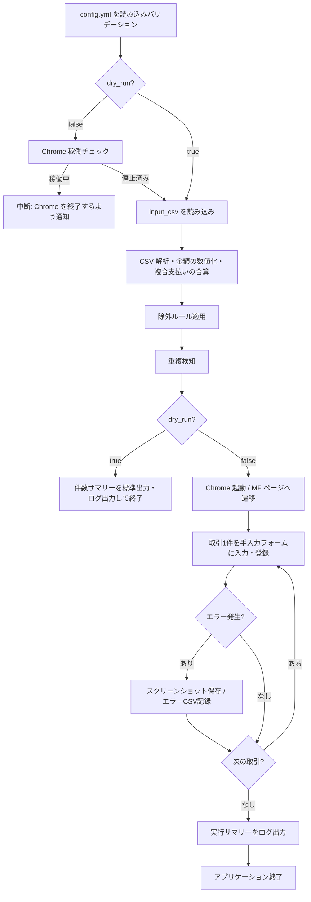

# 設計書

## 概要

### 背景・目的

- **背景**：PayPay の利用明細を目視で確認し、Money Forward ME に手動入力しているため、工数が大きい。
- **目的**：`config.yml` に PayPay CSV のパスを設定するだけで、Money Forward ME への
  登録を自動化し、入力ミスと作業時間を削減する。

### 機能一覧

| No | 機能名 | 概要 |
| ---- | -------- | ------ |
| F01 | CSV取り込み | Shift_JIS / UTF-8 の文字コードを自動判定し、カンマやダブルクォートを含む項目にも対応 |
| F02 | CSVパーシング | 全13列の抽出、金額の数値化、複合支払いの合算、入出金判定、海外取引時のメモ追記 |
| F03 | 除外ルール | `exclude_prefixes` に合致する取引番号の行を処理対象から除外する |
| F04 | 重複検知 | 取引番号を優先し、欠損時は日時＋金額＋取引先でローカルまたは Google Cloud Firestore と照合 |
| F05 | MFへの自動登録 | Playwright で Chrome を制御し、MF の手入力フォームに1件ずつ登録する |
| F06 | マッピング設定 | キーワードベースのカテゴリマッピングを `config.yml` で定義・編集可能 |
| F07 | 実行前チェック | Chrome が起動中の場合は処理を中断し、ユーザーに終了を促す |
| F08 | ドライランモード | ブラウザを使用せず、CSV の解析結果と変換結果の診断出力のみを行う |
| F09 | ログ出力 | 実行ログ、エラー CSV、スクリーンショットを `log_settings` の設定に従って出力 |
| F10 | 設定ファイル | ツールフォルダ直下の `config.yml` で動作設定を一元管理する |
| F11 | エラーハンドリング | 操作失敗時はスクリーンショットとログを保存し、ユーザーに再実行のための情報を提示 |

## 入力

### 設定ファイル

| 項目 | 内容 |
| ---- | ---- |
| ファイル名 | `config.yml` |
| 配置場所 | ツールフォルダ直下 |
| 形式 | YAML 1.2 |
| エンコーディング | UTF-8（BOM なし） |
| 内容概要 | ツール全体の動作設定 |

スキーマの詳細は「設定ファイル YAMLスキーマ仕様書.md」を参照。

#### 必須項目（5項目。未記載の場合は起動エラー）

| キー名 | データ型 | 説明 | 例 |
| ---- | ---- | ---- | ---- |
| chrome_user_data_dir | string | Chrome の User Data ディレクトリの絶対パス | `C:\Users\yourname\AppData\Local\Google\Chrome\User Data` |
| chrome_profile | string | 使用する Chrome プロファイルのフォルダ名 | `Default` |
| dry_run | boolean | `true`: CSV診断のみ（ブラウザ不使用）/ `false`: MF 本番登録 | `true` |
| input_csv | string | 処理対象の PayPay CSV ファイルのパス | `C:\Users\yourname\Downloads\paypay_history.csv` |
| mf_account | string | MF の手入力フォームで選択する口座名 | `PayPay残高` |

```yaml
chrome_user_data_dir: "C:\\Users\\yourname\\AppData\\Local\\Google\\Chrome\\User Data"
chrome_profile: "Default"
dry_run: true
input_csv: "C:\\Users\\yourname\\Downloads\\paypay_history.csv"
mf_account: "PayPay残高"
```

`input_csv`、`log_settings.logs_dir`、`advanced.mf_categories_path`、
`gcloud_credentials_path` に相対パスを指定した場合は、
`config.yml` の配置ディレクトリ基準で解決されます。

### 入力CSVファイル（PayPay 利用明細）

| 項目 | 内容 |
| ---- | ---- |
| 取得元 | PayPay アプリの「取引履歴」画面からエクスポート |
| 形式 | CSV |
| エンコーディング | UTF-8 または Shift_JIS（BOM 付き可） |
| ヘッダー | あり（1行目） |
| 区切り文字 | `,` |

| 列名 | データ型 | 説明 |
| ---- | ---- | ---- |
| 取引日 | datetime | 例: `2025/02/11 22:32:13` |
| 出金金額（円） | string | 数値またはハイフン（`-`）。カンマ区切りあり（例: `"1,280"`） |
| 入金金額（円） | string | 数値またはハイフン（`-`） |
| 海外出金金額 | string | 海外取引時の現地通貨金額。国内取引は `-` |
| 通貨 | string | 例: `JPY` / `USD`。国内取引は `-` |
| 変換レート（円） | string | 円換算レート。国内取引は `-` |
| 利用国 | string | 例: `JP`。国内取引は `-` |
| 取引内容 | string | MF メモ欄に転記される |
| 取引先 | string | マッピングルールのマッチング対象 |
| 取引方法 | string | 例: `PayPayカード VISA 4575` |
| 支払い区分 | string | 例: `一回払い` |
| 利用者 | string | 例: `本人` |
| 取引番号 | string | 重複検知の主キー。複合支払いは同一番号で複数行 |

```csv
取引日,出金金額（円）,入金金額（円）,海外出金金額,通貨,変換レート（円）,利用国,取引内容,取引先,取引方法,支払い区分,利用者,取引番号
2025/02/11 19:24:02,920,-,-,-,-,-,支払い,モスのネット注文,クレジット VISA 4575,-,本人,04639628474580213761
2025/02/10 12:55:55,330,-,-,-,-,-,支払い,キャンドゥ　横浜橋商店街,"PayPayポイント (73円), クレジット VISA 4575 (257円)",-,本人,04638686270424956930
2025/02/08 23:59:04,-,120,-,-,-,-,ポイント、残高の獲得,giftee,PayPayポイント,-,-,856574761326657536-a0196d18
```

## 出力

### ログファイル

詳細は「ログ出力」の章を参照してください。

### 解析エラーCSVファイル

| 項目 | 内容 |
| ---- | ---- |
| ファイル名 | `parse_error_yyyyMMdd_HHmmss.csv` |
| 配置場所 | `log_settings.logs_dir`（デフォルト: `<tool_folder>\logs`） |
| 内容概要 | `row_index` / `error_type` / `error_message` の最小列で構成される解析失敗一覧 |

### 登録失敗CSVファイル

| 項目 | 内容 |
| ---- | ---- |
| ファイル名 | `error_yyyyMMdd_HHmmss.csv` |
| 配置場所 | `log_settings.logs_dir`（デフォルト: `<tool_folder>\logs`） |
| 内容概要 | `failure_index` / `error_message` の最小列で構成される登録失敗一覧 |

### スクリーンショット

| 項目 | 内容 |
| ---- | ---- |
| ファイル名 | `screenshot_yyyyMMdd_HHmmss.png` |
| 配置場所 | `log_settings.logs_dir` |
| 出力条件 | `advanced.screenshot_on_error: true` を明示した場合のみ、エラー発生時 |

> 注意: logs 配下のログ、CSV、PNG は機微情報を含む可能性があります。共有フォルダやクラウド同期先に置かず、不要になったら削除してください。

## 実行方法

### 前提条件

1. `config.yml` をツールフォルダ直下に配置し、必須5項目を設定する。
2. Chrome が完全終了していること（本番実行時のみ）。
3. 本番実行時は、使用する Chrome プロファイルで Money Forward ME にログイン済みであること。

### ドライラン（推奨・初回確認用）

```bash
# config.yml の dry_run: true を設定してから実行
python main.py
```

ブラウザは起動しません。CSV の処理件数、除外件数、重複スキップ件数、登録対象件数などのサマリーを標準出力およびログに出力します。
ドライランでは重複履歴も更新しないため、同じ CSV を後から本番実行しても dry_run の結果だけで重複スキップされることはありません。
また、Chrome を起動しないため `chrome_user_data_dir` と
`chrome_profile` の存在チェックもスキップします。Chrome のない CI や
解析専用環境でも設定読み込みが可能です。

### 本番実行

```bash
# config.yml の dry_run: false を設定してから実行
python main.py
```

Chrome を指定の `chrome_user_data_dir` / `chrome_profile` で起動し、
MF の手入力フォームに1件ずつ自動登録します。

### EXE 配布版

```bat
paypay2mf.exe
```

事前に Playwright 用ブラウザのセットアップが完了している環境で実行してください。

## 依存関係の導入

通常利用では、プロジェクトルートで pyproject.toml に定義された依存関係をまとめてインストールしてください。

```bash
pip install -e .
```

開発用テストも含める場合は、以下を使用してください。

```bash
pip install -e ".[dev]"
```

Python 3.10 互換の型注釈として Self を利用しているため、
typing_extensions は runtime dependency に含まれます。
直接 import している third-party package は、転移依存に頼らず
pyproject.toml の dependencies または optional-dependencies に
明示的に定義します。

## 想定実行環境

| 項目 | 内容 |
| ---- | ---- |
| OS | Windows 11 |
| Python | 3.10 以上 |
| ブラウザ | Google Chrome（最新版） |
| Playwright ブラウザ | `playwright install chromium` 実行済み |
| Python ライブラリ | playwright / psutil / PyYAML / typing_extensions / google-cloud-firestore（任意） |

## 処理詳細

1. `config.yml` を読み込み、必須項目のバリデーションを行う。
2. Chrome プロセス稼働チェック（`dry_run: false` の場合のみ）。
  `chrome_user_data_dir` / `chrome_profile` の存在検証も本番実行時のみ行う。
3. `input_csv` を文字コード自動判定で読み込む。
4. 各行をパースし、不正行は `parse_error_*.csv` に記録したうえで、正常行だけに除外ルール・重複検知を適用する。
5. `dry_run: true` の場合は件数サマリーを出力して終了する（ブラウザ不使用）。
  重複履歴の JSON / Firestore は更新しない。
6. `dry_run: false` の場合は Playwright で Chrome を起動し、MF の手入力フォームに1件ずつ登録する。
7. 実行結果（成功件数・除外件数・重複スキップ件数・失敗件数・解析失敗件数）をログと各種 CSV に出力する。



## ログ出力

### ログ出力概要

| 項目 | 内容 |
| ---- | ---- |
| 出力先 | `<logs_dir>\app_yyyyMMdd_HHmmss.log` |
| ログレベル | INFO / ERROR |
| フォーマット | `yyyy-MM-dd HH:mm:ss [LEVEL] message` |

取引日、金額、加盟店、transaction_id などの個別取引明細は app ログへ出力しません。ログは件数サマリーとエラー状態の把握を主目的とします。

### ログ出力例（ドライラン）

```text
2026-03-28 10:00:00 [WARNING] logs_dir 配下のログ、CSV、PNG は機微情報を含む可能性があります。ローカル保管とし、共有やクラウド同期を避けてください。
2026-03-28 10:00:00 [INFO] DRY RUN: ブラウザを起動しません。CSV診断のみ実行します。
2026-03-28 10:00:00 [INFO] config.yml を読み込みました
2026-03-28 10:00:00 [INFO] CSV 読み込み完了: 正常 5件 / 解析失敗 0件
2026-03-28 10:00:00 [INFO] 除外: 1件
2026-03-28 10:00:00 [INFO] 重複スキップ: 0件
2026-03-28 10:00:00 [INFO] 処理対象: 4件
2026-03-28 10:00:00 [INFO] ドライラン完了: 登録対象 4件
```

### ログ出力例（本番実行）

```text
2026-03-28 10:05:00 [WARNING] logs_dir 配下のログ、CSV、PNG は機微情報を含む可能性があります。ローカル保管とし、共有やクラウド同期を避けてください。
2026-03-28 10:05:00 [INFO] config.yml を読み込みました
2026-03-28 10:05:00 [INFO] Chrome 稼働チェック: 停止済み
2026-03-28 10:05:01 [INFO] CSV 読み込み完了: 正常 5件 / 解析失敗 0件
2026-03-28 10:05:01 [INFO] 除外: 1件
2026-03-28 10:05:01 [INFO] 重複スキップ: 0件
2026-03-28 10:05:01 [INFO] 処理対象: 4件
2026-03-28 10:05:02 [INFO] Chrome を起動しました
2026-03-28 10:05:05 [INFO] MF ページへ遷移しました
2026-03-28 10:05:10 [ERROR] 登録失敗 (2/4): セレクタが見つかりません
2026-03-28 10:05:10 [WARNING] スクリーンショットを保存しました: screenshot_20260328_100510.png
2026-03-28 10:05:10 [WARNING] スクリーンショットは機微情報を含む可能性があります。共有しないでください。
2026-03-28 10:05:18 [INFO] 実行完了: 成功 3件 / 除外 1件 / 重複スキップ 0件 / 失敗 1件
2026-03-28 10:05:18 [WARNING] 登録失敗CSVを出力しました: error_20260328_100518.csv
2026-03-28 10:05:18 [WARNING] 登録失敗CSVは機微情報を含む可能性があります。共有しないでください。
2026-03-28 10:05:18 [INFO] アプリケーションを終了します
```

### ログメッセージ

| No. | レベル | テンプレート |
| ---- | ---- | ---- |
| 1 | WARNING | `logs_dir 配下のログ、CSV、PNG は機微情報を含む可能性があります。ローカル保管とし、共有やクラウド同期を避けてください。` |
| 2 | INFO | `DRY RUN: ブラウザを起動しません。CSV診断のみ実行します。` |
| 3 | INFO | `config.yml を読み込みました` |
| 4 | INFO | `CSV 読み込み完了: 正常 {success}件 / 解析失敗 {parse_failed}件` |
| 5 | INFO | `除外: {excluded}件` |
| 6 | INFO | `重複スキップ: {skipped}件` |
| 7 | INFO | `処理対象: {count}件` |
| 8 | INFO | `ドライラン完了: 登録対象 {count}件` |
| 9 | INFO | `Chrome 稼働チェック: {status}` |
| 10 | INFO | `Chrome を起動しました` |
| 11 | INFO | `MF ページへ遷移しました` |
| 12 | ERROR | `登録失敗 ({index}/{total}): {error_message}` |
| 13 | WARNING | `解析エラーCSVを出力しました: {filename}` |
| 14 | WARNING | `登録失敗CSVを出力しました: {filename}` |
| 15 | WARNING | `スクリーンショットを保存しました: {filename}` |
| 16 | INFO | `実行完了: 成功 {success}件 / 除外 {excluded}件 / 重複スキップ {skipped}件 / 失敗 {failed}件` |
| 17 | INFO | `アプリケーションを終了します` |

## Google Cloud Firestore バックエンドの設定（任意）

`duplicate_detection.backend: "gcloud"` を使用する場合は、以下の手順で GCP 環境を準備してください。

### 0. 事前に必要なパッケージのインストール

```bash
pip install "paypay2mf[gcloud]"
# または
pip install google-cloud-firestore
```

### 1. GCP プロジェクトの作成

1. [Google Cloud Console](https://console.cloud.google.com/) を開く
2. 左上のプロジェクト選択メニュー → 「新しいプロジェクト」
3. プロジェクト名を入力（例: `paypay2mf`）して「作成」

### 2. Firestore の有効化

1. Google Cloud Console の検索バーで「Firestore」と入力 → 「Firestore」を選択
2. 「データベースの作成」をクリック
3. **「Native mode」（ネイティブモード）** を選択して「続行」
4. リージョンは `asia-northeast1`（東京）を選択して「データベースを作成」

### 3. サービスアカウントの作成

1. Google Cloud Console → 「IAM と管理」 → 「サービスアカウント」
2. 「サービスアカウントを作成」をクリック
3. サービスアカウント名を入力（例: `paypay2mf-sa`） → 「作成して続行」
4. ロールに **「Cloud Datastore ユーザー」**（`roles/datastore.user`）を付与 → 「続行」 → 「完了」

### 4. JSON キーのダウンロード

1. 作成したサービスアカウントをクリック → 「キー」タブ
2. 「キーを追加」 → 「新しいキーを作成」 → 「JSON」 → 「作成」
3. ダウンロードされた JSON ファイルを安全な場所に保存
   （例: `C:\Users\yourname\paypay2mf-credentials.json`）

### 5. config.yml の設定

```yaml
duplicate_detection:
  backend: "gcloud"
  tolerance_seconds: 60

gcloud_credentials_path: "C:\\Users\\yourname\\paypay2mf-credentials.json"
```

`gcloud_credentials_path` も絶対パスに加えて `config.yml` 基準の相対パスを指定できます。

### 6. Firestore 複合インデックスの作成（フォールバック検索用）

取引番号が欠損している場合のフォールバック検索では、`amount + merchant` の複合クエリで候補を絞り込み、
取得した候補に対して `datetime` と `tolerance_seconds` を用いた許容幅判定を行います。  
初回実行時にインデックスエラーが発生した場合は、Firestore コンソールで以下の複合インデックスを作成してください。

| コレクション | フィールド 1 | フィールド 2 |
| ---- | ---- | ---- |
| `paypay_transactions` | `amount` (昇順) | `merchant` (昇順) |

> 注意: `duplicate_detection.backend: "gcloud"` を使用する場合、
> Firestore には `transaction_id` がある取引はその値、
> `transaction_id` がない取引は `datetime` / `amount` / `merchant` を重複判定用に保存します。

## ライセンス

### 本プログラムのライセンス

- このリポジトリのソースコードは MIT ライセンスです。詳細は同梱の LICENSE を参照してください。

### 使用ライブラリのライセンス

| ライブラリ名 | バージョン | ライセンス |
| ---- | ---- | ---- |
| playwright | 1.58.0 | Apache-2.0 |
| psutil | 7.2.2 | BSD-3-Clause |
| PyYAML | 6.0.3 | MIT |
| typing_extensions | 4.15.0 | PSF-2.0 |
| google-cloud-firestore | 任意 | Apache License 2.0 |

## 開発詳細

### 開発環境

- VS Code 最新版
- Python 3.10 以上

### 依存関係管理方針

- 直接 import する third-party package は、pyproject.toml の
  dependencies または optional-dependencies に必ず明示する。
- Python 3.10 互換維持のため、[src/mf_registrar.py](src/mf_registrar.py)
  の Self 型注釈は typing_extensions を使用する。
- optional dependency は [src/duplicate_detector.py](src/duplicate_detector.py)
  のように遅延 import と案内メッセージを組み合わせ、
  未導入環境でも基本機能が動作するようにする。

### UI 自動化の保守方針

- Money Forward の DOM セレクタ契約は [src/mf_selectors.py](src/mf_selectors.py) に集約する。
- 手入力モーダルの UI 操作は
  [src/mf_page.py](src/mf_page.py) の `MFManualFormPage` にまとめる。
- Money Forward のカテゴリ対応表は
  [src/mf_categories.yml](src/mf_categories.yml) を既定とし、
  必要時のみ `config.yml` の `advanced.mf_categories_path` で差し替える。
- 独自カテゴリ YAML のひな形として [mf_categories_sample.yml](mf_categories_sample.yml) を同梱している。差し替え時はこの形式をベースに編集する。
- [src/mf_registrar.py](src/mf_registrar.py) はブラウザ起動と
  コンテキスト管理に専念させる。
- DOM 変更対応時は、まず selector 定義と Page Object を確認し、registrar 本体へ直接セレクタを増やさない。

`advanced.mf_categories_path` に相対パスを指定した場合は
`config.yml` の配置ディレクトリ基準で解決されます。
差し替え先 YAML は `middle_to_large:` をルートに持ち、
中項目名から大項目名への対応を定義してください。
指定時は完全置換になるため、必要な中項目をサンプルから削らずに調整してください。

### Playwright スモークテスト

Money Forward 実サイトに対するスモークテストは通常の `pytest` には含めません。ログイン済み Chrome プロファイルを用意し、必要な環境変数を設定したうえで明示実行してください。

PowerShell 例:

```powershell
$env:PAYPAY2MF_RUN_SMOKE_TEST = "1"
$env:PAYPAY2MF_SMOKE_CHROME_USER_DATA_DIR = "C:\Users\yourname\AppData\Local\Google\Chrome\User Data"
$env:PAYPAY2MF_SMOKE_CHROME_PROFILE = "Default"
$env:PAYPAY2MF_SMOKE_MF_ACCOUNT = "PayPay残高"
c:/Git/PayPay2MF/.venv/Scripts/python.exe -m pytest -m smoke_test tests/test_mf_smoke.py
```

このスモークテストは、Money Forward の入出金ページへ遷移し、手入力モーダルが開けることだけを確認します。実データの送信や保存は行いません。

### 検証環境

| 項目 | 内容 |
| ---- | ---- |
| OS | Windows 11 |
| ブラウザ | Google Chrome（最新版） |
| Python | 3.10 以上 |

## 改訂履歴

| バージョン | 日付 | 内容 |
| ----- | ---------- | -------------- |
| 0.1 | 2026-03-28 | 初版作成 |
