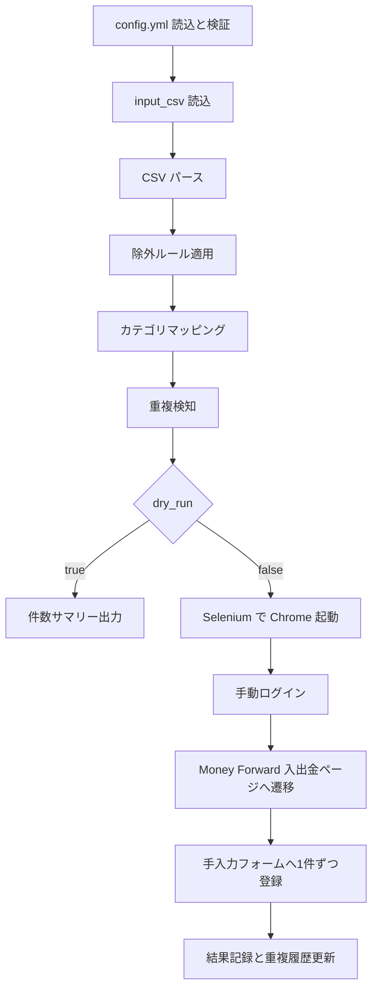

# 基本設計書

## 1. 目的

本書は、PayPay の利用明細 CSV を Money Forward ME へ登録する
PayPay2MF の基本設計をまとめた文書である。

README は導入と実行手順、
[設定ファイル仕様書](設定ファイル仕様書.md) は設定契約、
[テスト仕様書](テスト仕様書.md) は検証手順を扱う。
本書はその中間に位置づけ、処理全体の流れ、責務分担、保存物、
運用上の制約を説明する。

## 2. 対象範囲

- 対象:
  PayPay CSV の読込、変換、除外、重複検知、Money Forward 手入力登録、
  ログ出力、Firestore backfill の設計
- 対象外:
  Money Forward 側の業務仕様そのもの、Google Cloud の詳細な導入手順、
  テストケースの個別操作手順

## 3. システム全体像

### 3.1 入出力

- 入力:
  `config.yml`、PayPay 利用明細 CSV、任意の Firestore 認証 JSON
- 外部依存:
  Google Chrome、Selenium、Money Forward ME、任意で Firestore
- 出力:
  app ログ、解析エラー CSV、登録失敗 CSV、スクリーンショット、
  local backend 用 `processed.json`

### 3.2 全体フロー

## 4. 実行モード

### 4.1 dry_run

- ブラウザを起動しない
- CSV 読込、変換、除外、重複判定までを実行する
- local / gcloud いずれの重複履歴も更新しない
- 実行前の診断と設定確認を目的とする

### 4.2 本番実行

- Selenium が一時プロファイルで Chrome を起動する
- ユーザーが手動ログインして Enter を押す
- Money Forward の入出金ページへ遷移し、手入力フォームで登録する
- 成功時に重複履歴を更新する

### 4.3 smoke_test

- 実サイトに対してログイン導線と手入力モーダル起動だけを確認する
- 実データ送信は行わない
- DOM 変更時の一次切り分けを目的とする

### 4.4 backfill CLI

- Firestore backend の既存ドキュメントへ `date_bucket` を補完する
- 本体アプリとは別の CLI として提供する
- `duplicate_detection.backend: "gcloud"` を前提とする
- `gcloud_credentials_path` が必須で、`duplicate_detection.database_id` は
  本体と同じ検証ルールに従う
- 本体設定の `dry_run` は参照せず、backfill CLI 自身の `--dry-run` と
  `--limit` で挙動を制御する
- 初回導入時は `--dry-run` で走査件数と更新予定件数を確認してから
  実行する

## 5. モジュール責務

### 5.1 エントリーポイント

- [src/paypay2mf/cli.py](../src/paypay2mf/cli.py)
  設定読込、CSV パース、除外、マッピング、重複検知、登録、
  サマリー出力を順番に実行するオーケストレータ

### 5.2 設定読込

- [src/paypay2mf/config_loader.py](../src/paypay2mf/config_loader.py)
  `config.yml` の探索、YAML 読込、必須項目・型・パスの検証、
  `AppConfig` への変換を担当する

### 5.3 CSV 変換

- [src/paypay2mf/csv_parser.py](../src/paypay2mf/csv_parser.py)
  文字コード自動判定、CSV 読込、行単位の `Transaction` 変換、
  `ParseFailure` 収集を担当する

### 5.4 除外とカテゴリ付与

- [src/paypay2mf/filter.py](../src/paypay2mf/filter.py)
  `exclude_prefixes` による除外と `mapping_rules` によるカテゴリ付与を担当する

### 5.5 重複検知

- [src/paypay2mf/duplicate_detector.py](../src/paypay2mf/duplicate_detector.py)
  local JSON / Firestore の両 backend を提供し、
  行単位指紋（row_fingerprint）による重複判定を担当する

### 5.6 ブラウザ起動とログイン導線

- [src/paypay2mf/mf_registrar.py](../src/paypay2mf/mf_registrar.py)
  Chrome 起動、一時プロファイル管理、手動ログイン待ち、
  `/cf` への導線、スクリーンショット保存を担当する

### 5.7 手入力フォーム操作

- [src/paypay2mf/mf_page.py](../src/paypay2mf/mf_page.py)
  Money Forward 手入力モーダルの Page Object として、
  口座選択、カテゴリ選択、メモ、日付入力、submit 結果判定を担当する

### 5.8 ログと保存物

- [src/paypay2mf/log_manager.py](../src/paypay2mf/log_manager.py)
  app ログ作成、ログローテーション、解析エラー CSV、登録失敗 CSV を担当する

### 5.9 補助 CLI

- [src/paypay2mf/firestore_backfill.py](../src/paypay2mf/firestore_backfill.py)
  Firestore の `date_bucket` backfill を担当する

## 6. データモデル

データモデルは [src/paypay2mf/models.py](../src/paypay2mf/models.py) に定義する。

### 6.1 AppConfig

- 実行モード、入力 CSV、Money Forward 口座、マッピング、除外ルール、
  重複検知設定、ログ設定、高度設定をまとめた最上位設定
- `runtime_base_dir` は相対パス解決の基準になる

### 6.2 Transaction

- 正常に解釈できた 1 取引を表す
- 金額は整数、入出金方向は `out` / `in`
- `transaction_id` が欠損するケースを許容する
- 重複判定に必要なメタ情報（`date_text`、`content`、`method`、
  `payment_type`、`user`、`row_fingerprint`）を保持する

### 6.3 ParseFailure

- CSV の物理行単位の変換失敗を表す
- 正常行の処理を止めず、後段で parse error CSV に出力する

## 7. 設定設計

- 必須項目は `dry_run`、`input_csv`、`mf_account` の 3 項目
- `input_csv`、`gcloud_credentials_path`、`advanced.mf_categories_path` は
  ファイルであることを要求する
- `log_settings.logs_dir` はディレクトリで扱う
- 相対パスは実行時カレントディレクトリではなく
  `config.yml` の配置ディレクトリ基準で解決する
- 設定項目の型・必須・デフォルト値は
  [設定ファイル仕様書](設定ファイル仕様書.md) を正本とする

## 8. CSV パース設計

### 8.1 文字コード

- `parser.encoding_priority` の順で読込可能性を判定する
- UTF-8 系は BOM 付きも扱う

### 8.2 正常化

- 金額のカンマや引用符を除去して整数化する
- 出金・入金の両方が 0、または両方が正数の行は異常行として扱う
- メモは取引先をベースとし、海外取引は補足情報（利用国・通貨）を追記する

### 8.3 同一 transaction_id 複数行の扱い

- CSV の各物理行を個別に解釈し、同一 `transaction_id` でも合算しない
- 解析失敗時の `row_index` は失敗した物理行を指す

## 9. 重複検知設計

### 9.1 local backend

- 保存先は `logs_dir` 配下の `processed.json`
- 判定キーは `row_fingerprint`（sha256）を使用する
- `processed.json` は `row_fingerprints` 配列を保持する
- 実行中はメモリに保持し、登録ループ終了時に 1 回だけ flush する
- `dry_run` では更新しない

### 9.2 gcloud backend

- Firestore の `paypay_transactions` コレクションを利用する
- Firestore の document id には `row_fingerprint` を使用する
- 本体アプリの重複判定は document id の直接取得で行うため、専用の複合 index は不要
- payload には監査用に `datetime`、`amount`、`merchant`、
  `transaction_id`、`row_fingerprint`、`date_bucket` を保存する

### 9.3 date_bucket

- `datetime` の秒とマイクロ秒を 0 に丸めた分単位の検索補助キーで、
  形式は `YYYYMMDDHHMM` とする
- 本体の重複判定には使用せず、Firestore payload と backfill 対応のために保持する
- 既存データへ補完するための backfill CLI を別途提供する

### 9.3A Firestore クエリ戦略

- 本体アプリは `row_fingerprint` を document id に使うため、重複判定時は `document(id).get()` のみを行う
- このため、現行の重複判定フローでは
  `date_bucket`、`amount`、`merchant` を対象にした複合 index を前提にしない
- `date_bucket` は backfill や運用時の調査、
  将来の集計系クエリに備えた検索補助項目として保存する
- `date_bucket` を条件にした一覧取得や集計を追加する場合は、
  実際の where/order_by の組み合わせに応じて
  Firestore 側で複合 index を定義する
- `database_id` を切り替える運用では、index 定義もデータベース単位で管理する

### 9.4 重複履歴更新失敗時の扱い

- Money Forward への登録後に `mark_processed` が失敗した場合は、
  同じ CSV の再実行で重複登録が起こり得るため、その時点で処理を中断する
- 登録ループ終了後の `flush` 失敗も同等に重大とみなし、異常終了する
- したがって、重複履歴更新失敗は「登録失敗」ではなく
  「登録結果と履歴状態が不一致のため継続不能」として扱う

## 10. Money Forward UI 自動化設計

### 10.1 ブラウザ起動方針

- Selenium で Chrome を起動する
- 既存ユーザープロファイルは使わず、一時プロファイルを作成する
- Selenium Manager の統計送信は必要に応じて抑止する

### 10.2 ログイン導線

- Money Forward トップページを開く
- ユーザーが手動ログインして Enter を押した後、
  家計簿タブを経由して `/cf` へ遷移する

### 10.3 手入力フォーム操作

- Page Object で DOM 契約を集中管理する
- 金額、口座、カテゴリ、メモ、日付の順で入力する
- `mf_account` は末尾の残高サフィックスを除去して照合する
- カテゴリ未解決時は warning を出し、未分類で継続する
- JavaScript による補助操作が失敗した場合でも、TAB や通常 click などの
  代替操作で継続を試みる

### 10.4 submit 結果判定

- まず手入力モーダルが非表示または消滅していれば成功として扱う
- モーダルが残っている場合は、`入力を保存しました。` メッセージ、または
  続行ボタンの表示を成功シグナルとして扱う
- 成功確認画面が表示された場合は、閉じる操作を行ったうえで次の取引へ進む
- フォーム内エラー要素が表示された場合は失敗として扱う
- 上記のいずれにも該当しないまま結果を判定できない場合は timeout エラーとする

## 11. ログ・エラー・保存物

### 11.1 app ログ

- 件数サマリーとエラー状態の把握を主目的とする
- 個別取引の詳細は通常ログへ出さない

### 11.2 解析エラー CSV

- `parse_error_*.csv`
- 最小列は `row_index`、`error_type`、`error_message`
- `error_type` は `missing_column`、`invalid_date`、`invalid_value`、
  `conversion_error` のいずれかを出力する

### 11.3 登録失敗 CSV

- `error_*.csv`
- 最小列は `failure_index`、`error_message`

### 11.4 スクリーンショット

- `advanced.screenshot_on_error: true` の場合のみ保存する
- Selenium driver 未初期化時は保存せず warning のみ出す

### 11.5 processed.json

- local backend の重複履歴
- 保存内容は `row_fingerprints` 配列のみとし、行単位指紋を保持する
- 破損時は `processed.corrupted_*.json` として退避し、
  明示エラーで起動を止める

## 12. 外部依存と運用制約

- OS は Windows を主対象とする
- Google Chrome と Selenium に依存する
- Money Forward の DOM 変更は最も壊れやすい外部要因である
- local backend は単一インスタンス運用を前提とする
- ログ、CSV、スクリーンショット、認証情報 JSON はローカル保管前提とする

## 13. テスト戦略と保守観点

### 13.1 テストレイヤー

- 単体テスト:
  純粋ロジックと設定検証
- integration_flow:
  main フローのオーケストレーションと副作用
- ui_contract:
  Fake DOM と Fake driver による UI 契約検証
- smoke_test:
  実ブラウザでのログイン導線とモーダル起動確認
- 手動 E2E:
  実アカウントへの登録確認

### 13.2 保守時の見る順番

1. 実行失敗が設定起因か、CSV 変換起因か、UI 起因かを切り分ける
2. UI 起因なら [src/paypay2mf/mf_selectors.py](../src/paypay2mf/mf_selectors.py) と
  [src/paypay2mf/mf_page.py](../src/paypay2mf/mf_page.py) を優先確認する
3. 重複判定起因なら
  [src/paypay2mf/duplicate_detector.py](../src/paypay2mf/duplicate_detector.py)
  と Firestore / processed.json の状態を確認する
4. 出力物やローテーション起因なら
  [src/paypay2mf/log_manager.py](../src/paypay2mf/log_manager.py) を確認する

詳細なテスト手順は [テスト仕様書](テスト仕様書.md) を正本とする。

## 14. 関連文書

- [README.md](../README.md): 導入、最短実行手順、利用上の注意
- [設定ファイル仕様書](設定ファイル仕様書.md): 設定項目の契約
- [テスト仕様書](テスト仕様書.md): テストケースと受入手順
